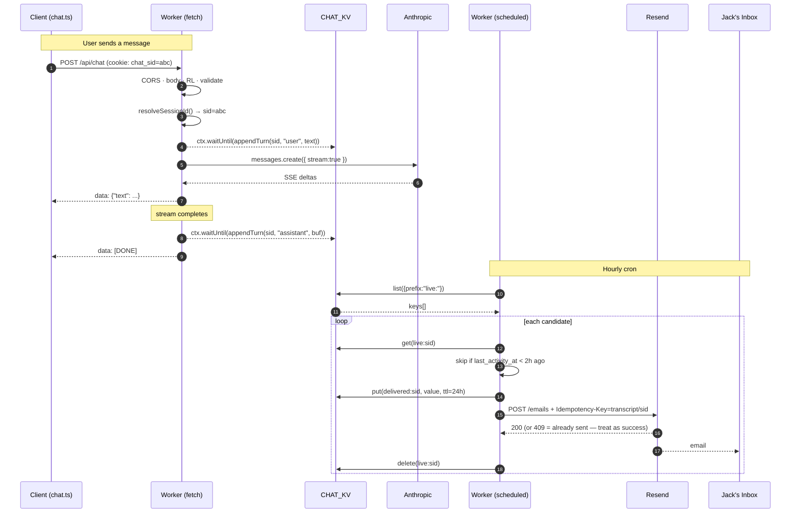

# Architecture Research — v1.3 Chat Visibility

**Domain:** Astro 6 portfolio (subsequent milestone — adds KV transcript persistence + Resend email delivery to existing Cloudflare Workers SSR `/api/chat`)
**Researched:** 2026-05-09
**Confidence:** HIGH (existing surface fully mapped from source; Cloudflare/Resend integration verified against Cloudflare + Resend official docs via Context7)

---

## 1. Existing Architecture Snapshot (baseline — DO NOT re-derive)

```
                    Cloudflare (Pages-style Workers Static Assets)
                          jackcutrara.com
┌───────────────────────────────────────────────────────────────────────┐
│  BaseLayout.astro (head, SEO, Fonts API, SkipToContent, ChatWidget)   │
│  Static HTML pages served via env.ASSETS                              │
└───────────────────────────────────┬───────────────────────────────────┘
                                    │ chat.ts (client widget)
                                    ▼ POST /api/chat (SSE)
                    ┌──────────────────────────────────────┐
                    │ src/pages/api/chat.ts                │
                    │   prerender = false (SSR per-route)  │
                    │   ┌────────────────────────────────┐ │
                    │   │ 1. CORS check                  │ │
                    │   │ 2. Body-size guard             │ │
                    │   │ 3. Rate limit (CHAT_RATE_LIMITER│ │
                    │   │    binding — currently absent  │ │
                    │   │    in prod; defensive skip)    │ │
                    │   │ 4. Validate + sanitize         │ │
                    │   │ 5. Anthropic.messages.create() │ │
                    │   │    .stream → SSE → client      │ │
                    │   └────────────────────────────────┘ │
                    └──────────────────────────────────────┘
```

**Worker entrypoint today:**
`wrangler.jsonc` → `"main": "@astrojs/cloudflare/entrypoints/server"` (the unified Astro adapter entrypoint — only exports `fetch`).

**Auto-generated bindings** (from `dist/server/wrangler.json`):
- `ASSETS` (binding for `./dist/client`)
- `IMAGES` (built-in image transforms)
- `kv_namespaces: [{ binding: "SESSION" }]` ← auto-injected by `@astrojs/cloudflare` for the Astro Sessions API (default name; `sessionKVBindingName` adapter option). **Do not co-opt this for transcripts.**
- `triggers: {}` ← empty today; will receive `crons` in v1.3

**Client-side state today:**
- `localStorage` chat history (`chat-history` key, 50-msg cap, 24h TTL, version=1).
- No client-generated session ID. Each browser tab/session is anonymous from the server's perspective; the server sees only the 30-message rolling history posted with every turn.

**Constraint envelope (Phase 7 contract — must not regress):**
- D-26 chat regression battery (117/117) covers SSE-streaming, CORS, rate-limit defensive skip, validation/sanitize, mid-stream error frame, `[DONE]` terminator, `truncated:true` diagnostic frame, focus trap, XSS sanitization.
- D-15 server byte-identical (any v1.3 phase touching `chat.ts`/`api/chat.ts` must prove no behavioral diff to streamed bytes).

---

## 2. Architectural Decision Tree

```
Q: Add scheduled() handler to existing /api/chat route?
  └── NO. Astro API routes only handle fetch. The ScheduledController
      surface is on the Worker default export, not on individual routes.

Q: Extend the Astro adapter's bundled entrypoint?
  └── NO. @astrojs/cloudflare/entrypoints/server is the adapter's
      shipped shim; mutating it is unsupported and breaks on adapter
      upgrades (we already ship 13.1.7 — moving target).

Q: Switch to a custom worker entrypoint that calls handle() + adds scheduled()?
  └── YES. This is the documented pattern (Astro docs:
      "Standard Cloudflare Worker Export Handler"). Single Worker
      retains fetch (SSE chat + static assets) AND gains scheduled()
      for the cron. Same env, same bindings, same KV reads/writes.

Q: Where does the KV write happen during streaming?
  └── AFTER the stream completes (assistant turn) and BEFORE the stream
      starts (user turn). NOT per-token — KV's 1-write/sec/key cap
      makes per-token writes fatal. NOT inside the SSE controller's
      try/catch — write must be queued via ctx.waitUntil() so a slow
      KV put never delays the client's [DONE] frame.

Q: Single KV key per session, or split metadata + messages?
  └── Single key per session (whole-document write). Split designs
      add list() round-trips on every turn and don't help here —
      Jack reads transcripts whole, never aggregates. KV's
      whole-value 25 MiB cap is 4+ orders of magnitude over our
      worst-case transcript size (30 msgs × 4 KiB ≈ 120 KiB).

Q: How to guarantee send-once when cron may run while a write is in flight?
  └── Two-keyspace partition + Resend Idempotency-Key header.
      (1) live:{sid} — cron candidate keyspace, 30d TTL
      (2) Cron promotes via copy-and-delete to delivered:{sid},
          24h TTL (matches Resend idempotency window) before sending,
          using Resend's Idempotency-Key = "transcript/{sid}".
      Even if two crons race or a worker restart re-enters the loop,
      Resend itself collapses duplicates within 24h.
```

---

## 3. Target Architecture (v1.3)

```
                    Cloudflare Workers (single deployment)
                          jackcutrara.com
┌──────────────────────────────────────────────────────────────────────────┐
│  src/worker.ts  ◄── NEW custom entrypoint                                │
│    export default {                                                      │
│      fetch(req, env, ctx)     → handle(req, env, ctx)  // Astro adapter  │
│      scheduled(controller, env, ctx) → ctx.waitUntil(deliverDue(env))    │
│    }                                                                     │
└──────┬───────────────────────────────────────┬───────────────────────────┘
       │ /api/chat (SSE — unchanged path)      │ Cron Trigger: 0 * * * *
       ▼                                       ▼
┌───────────────────────────┐    ┌──────────────────────────────────────┐
│ src/pages/api/chat.ts     │    │ src/lib/chat-delivery.ts (NEW)       │
│ (existing SSR endpoint)   │    │   deliverDue(env):                   │
│   ┌──────────────────────┐│    │     ├── listLiveCandidates()         │
│   │ 1. CORS, body, RL    ││    │     │   (env.CHAT_KV.list({          │
│   │ 2. Validate/sanitize ││    │     │     prefix: "live:"          })│
│   │ 3. resolveSessionId()││    │     ├── filter inactivity ≥ 2h       │
│   │    (NEW: cookie or   ││    │     ├── for each candidate:          │
│   │     X-Chat-Session   ││    │     │     a) read live transcript    │
│   │     header)          ││    │     │     b) PUT delivered:{sid}     │
│   │ 4. persistTurn(env,  ││    │     │        with same value + 24h   │
│   │    sid, userMsg) via ││    │     │        TTL (idempotency        │
│   │    ctx.waitUntil()   ││    │     │        marker)                 │
│   │ 5. SSE stream from   ││    │     │     c) POST Resend             │
│   │    Anthropic         ││    │     │        + Idempotency-Key       │
│   │ 6. on stream close:  ││    │     │     d) DELETE live:{sid}       │
│   │    persistTurn(env,  ││    │     └── return summary log           │
│   │    sid, asstMsg) via ││    └──────────────────────────────────────┘
│   │    ctx.waitUntil()   ││                  │
│   └──────────────────────┘│                  ▼
└───────────────────────────┘    ┌──────────────────────────────────────┐
       │                          │ src/lib/chat-transcripts.ts (NEW)    │
       └──── persistTurn() ──────►│   appendTurn(env, sid, role, msg, m) │
                                  │   ├── read live:{sid} (or seed)     │
                                  │   ├── append turn, update timestamps │
                                  │   ├── apply 30-msg cap (server)     │
                                  │   └── PUT live:{sid} with 30d TTL,  │
                                  │       metadata { last_activity_at } │
                                  └──────────────────────────────────────┘
                                                  │
                                                  ▼
                              env.CHAT_KV (NEW kv_namespaces binding)
                              ─────────────────────────────────────
                              live:{sid}      → {messages, meta...}  (30d TTL)
                              delivered:{sid} → {messages, meta...}  (24h TTL)
```

### 3.1 Files added / touched

| Path | Status | Purpose |
|------|--------|---------|
| `src/worker.ts` | NEW | Custom Worker entrypoint. Re-exports Astro's `handle(req, env, ctx)` for fetch + adds `scheduled(controller, env, ctx)`. ~30 LOC. |
| `src/lib/chat-transcripts.ts` | NEW | Pure module — no I/O imports beyond `KVNamespace`. Owns the data shape, append-and-cap logic, key naming, schema versioning. Unit-testable in isolation. |
| `src/lib/chat-delivery.ts` | NEW | Cron-side logic — `listLiveCandidates`, `deliverOne`, `deliverDue`. Holds the email-rendering helpers (HTML-escape, transcript→html). Imports `chat-transcripts.ts` for shape constants. |
| `src/lib/email/resend.ts` | NEW | Thin `fetch()` wrapper around `https://api.resend.com/emails` (NOT the npm SDK — REST is zero-dep and Workers-native). Owns header injection of `Idempotency-Key`. |
| `src/lib/sessions.ts` | NEW | `resolveSessionId(request, response)` — reads `chat_sid` cookie or `X-Chat-Session` header; mints `crypto.randomUUID()` if absent and sets `Set-Cookie` on response. |
| `src/pages/api/chat.ts` | TOUCH | Insert two `ctx.waitUntil(persistTurn(...))` calls — once for the user message before streaming, once after stream close for the assistant message. Add `resolveSessionId()` call. ~15 LOC delta. |
| `src/scripts/chat.ts` | TOUCH (minimal) | Optional: read+send `X-Chat-Session` header if cookie path is blocked (third-party cookie hostility). 1 fetch-options field. |
| `wrangler.jsonc` | TOUCH | (a) change `main` from `@astrojs/cloudflare/entrypoints/server` → `./src/worker.ts`; (b) add `kv_namespaces` entry for `CHAT_KV`; (c) add `triggers.crons: ["0 * * * *"]`; (d) add `vars.CHAT_RECIPIENT_EMAIL`; secrets `RESEND_API_KEY` via `wrangler secret put`. |
| `astro.config.mjs` | UNCHANGED | Adapter call stays the same. The custom entrypoint pattern is set entirely via wrangler. |

### 3.2 Out-of-band wiring (one-time)

- `npx wrangler kv namespace create CHAT_KV` (and `... --preview` for dev)
- `npx wrangler secret put RESEND_API_KEY`
- `npx wrangler secret put CHAT_RECIPIENT_EMAIL` (or `vars` if non-secret — Jack's email is not secret per se but secret-by-default keeps the public repo clean)
- DNS: verify Resend sender domain (jackcutrara.com or a subdomain) — DKIM/SPF/Return-Path

---

## 4. Integration Points (file-line specificity for the executor)

### 4.1 `src/worker.ts` (NEW, ~30 LOC)

```ts
import { handle } from "@astrojs/cloudflare/handler";
import { deliverDue } from "./lib/chat-delivery";

export interface Env {
  ASSETS: Fetcher;                    // existing
  IMAGES: ImagesBinding;              // existing
  SESSION: KVNamespace;               // existing (Astro Sessions; do not touch)
  CHAT_KV: KVNamespace;               // NEW
  ANTHROPIC_API_KEY: string;          // existing secret
  RESEND_API_KEY: string;             // NEW secret
  CHAT_RECIPIENT_EMAIL: string;       // NEW var
  CHAT_RATE_LIMITER?: RateLimit;      // existing carry-forward (DEBT)
}

export default {
  async fetch(request, env, ctx) {
    return handle(request, env, ctx); // Astro app handles all routes
  },
  async scheduled(controller, env, ctx) {
    ctx.waitUntil(deliverDue(env, controller.scheduledTime));
  },
} satisfies ExportedHandler<Env>;
```

### 4.2 `src/pages/api/chat.ts` insertion points

Insert **two** `ctx.waitUntil()` calls (the Astro APIRoute receives `{ request, locals }` — execution context is reachable via `locals.cfContext` per the Astro 6 cloudflare adapter docs):

1. **After validation, before stream open** (line ~85, just after `sanitizeMessages`):
   ```ts
   const sid = resolveSessionId(request, responseHeaders);
   const userMsg = messages[messages.length - 1];
   if (userMsg.role === "user") {
     locals.cfContext.waitUntil(
       appendTurn(env.CHAT_KV, sid, "user", userMsg.content, requestMeta)
     );
   }
   ```

2. **At stream-close, before `controller.close()`** (line ~136, immediately before `controller.enqueue("data: [DONE]")`):
   ```ts
   if (assistantBuffer) {
     locals.cfContext.waitUntil(
       appendTurn(env.CHAT_KV, sid, "assistant", assistantBuffer, null)
     );
   }
   ```

   The streaming loop must accumulate `assistantBuffer += event.delta.text` so the post-stream write has the full message (the existing loop already iterates per delta — adding one accumulator is byte-budget-trivial).

**Why these two insertion points (and not "per token"):**
- KV is rate-limited to 1 write/sec/key. The user turn arrives once → one write. The assistant turn streams over 1–10 seconds → if we wrote per token we'd 429 ourselves and lose the transcript.
- `ctx.waitUntil()` runs AFTER the response is sent to the client, so KV latency never blocks SSE.
- Using `waitUntil` ensures the Worker is held alive until the write completes (otherwise the runtime can terminate before `kv.put()` resolves).

**Failure mode:** if the user-turn write fails (network blip on Cloudflare's KV control plane), the assistant-turn write will still happen and the cron will deliver an incomplete transcript (assistant only). Acceptable — chat UX is unaffected. Alternative would be batching both writes after stream close, but that loses partial transcripts when SSE aborts mid-stream (which is the most interesting failure mode to log).

### 4.3 `src/scripts/chat.ts` minimal touch

The cookie path is preferred (`Set-Cookie: chat_sid=...; SameSite=Lax; HttpOnly; Secure; Path=/api/chat; Max-Age=2592000`). `HttpOnly` keeps the cookie out of `document.cookie` — JS never sees it, but the browser sends it on every `fetch("/api/chat")`. Zero client changes needed in the happy path.

If we need a fallback for testing or for users who block first-party cookies on `*.pages.dev` preview (rare), we add:
```ts
const sid = (() => {
  const k = "chat-sid";
  let v = localStorage.getItem(k);
  if (!v) { v = crypto.randomUUID(); localStorage.setItem(k, v); }
  return v;
})();
// in streamChat fetch():
headers: { "Content-Type": "application/json", "X-Chat-Session": sid },
```

**Recommendation:** ship cookie-only initially (zero client diff, byte-identical to D-15). Add header fallback only if Phase-7-D-26 testing surfaces a cookie-rejection case.

---

## 5. Data Flow (full lifecycle, mermaid)



**Key invariants in this flow:**
1. Steps 4 and 9 are non-blocking on the SSE response (waitUntil).
2. Step 14 (PUT delivered) before step 15 (POST Resend) is the critical ordering for crash-safety: if the Worker dies between 15 and 16, the next cron sees no `live:{sid}` AND a `delivered:{sid}` exists → skip. If the Worker dies between 14 and 15, the next cron sees both → re-attempt POST with same Idempotency-Key → Resend dedupes. If the Worker dies between 13 and 14, the next cron just retries the whole transaction.
3. The 2-hour inactivity check happens at step 12, AFTER read but BEFORE the irreversible PUT delivered. This is the only "decide" step.

---

## 6. KV Data Shape (single key per session, with rationale)

### 6.1 Decision: single key per session, whole-document writes

**Rejected:** split keys (`session:{sid}:meta`, `session:{sid}:msg:{n}`).
- **Why rejected:** KV `list()` returns 1,000 keys max per call; 1 active session ≈ 30 keys at the cap means we run out of room at ~33 concurrent sessions. List-pagination + n+1 round-trips on every turn is O(n) for read-modify-write. Zero benefit because Jack reads the whole transcript.

**Rejected:** hash-prefix sharding (`live:{hash[0:2]}/{sid}`).
- **Why rejected:** sharding solves uneven write distribution at scale. Our scale is "single-digit visitors per day, low-double-digit on a recruiter-link day." YAGNI.

**Selected:** single key per session, two-keyspace partition (`live:` and `delivered:`).
- **Why:** every turn is a single read + single write on a known key. List operation runs once per cron cycle, scoped to `live:` prefix only (delivered transcripts are out of the candidate set). Atomic from the Worker's POV (KV is last-write-wins; per-key concurrency is bounded by the 1-write/sec/key cap, which is fine because a single user can't physically send turns faster than Anthropic streams).

### 6.2 Shape

**Key naming:**
- `live:{sid}` — active conversation, candidate for cron delivery, 30-day TTL
- `delivered:{sid}` — sent transcript, idempotency marker + backup, 24-hour TTL (matches Resend's idempotency window — after that, the dedupe protection lapses but the conversation is also cold)

**Value (JSON, written via `JSON.stringify`):**
```ts
interface ChatTranscript {
  v: 1;                              // schema version (CRITICAL — see PITFALLS.md)
  sid: string;                       // session id (denormalized for log readability)
  started_at: string;                // ISO 8601, set on first turn
  last_activity_at: string;          // ISO 8601, updated every turn
  msg_count: number;                 // server-side count (for cap enforcement)
  meta: {
    referrer: string | null;         // request.headers.get("Referer"), <=512 chars
    user_agent: string | null;       // request.headers.get("User-Agent"), <=512 chars
    country: string | null;          // request.cf.country (Cloudflare-injected)
    asn: number | null;              // request.cf.asn — useful for "is this a recruiter or a bot?"
  };
  messages: Array<{
    role: "user" | "assistant";
    content: string;                 // RAW user-typed text (escape at render time, not store time)
    ts: string;                      // ISO 8601
  }>;
}
```

**Metadata block on the KV entry itself** (the `metadata` parameter of `kv.put`, max 1024 bytes serialized):
```ts
{ last_activity_at: "2026-05-09T18:23:11.000Z", msg_count: 7 }
```

This lets the cron's `list({ prefix: "live:" })` filter by inactivity **without** fetching each value — `keys[].metadata.last_activity_at` is returned in the list response. **Massive optimization** for the cron path: O(1) network round-trips instead of O(n).

### 6.3 Caps and TTLs

| Constraint | Value | Rationale |
|------------|-------|-----------|
| `messages.length` server cap | 30 | Matches existing client-side `MAX_MESSAGES = 50` minus the half-only buffer; protects the 25 MiB KV value cap with 4-orders-of-magnitude margin (30 × 4 KiB = 120 KiB worst case). |
| `meta.referrer/user_agent` length | 512 chars | Prevent log poisoning; Cloudflare's UA values cap there in practice. |
| `live:` TTL | 30 days (2,592,000 sec) | If cron fails for 30 consecutive days, the entry self-evicts. Acceptable — that's an outage worth losing data over. |
| `delivered:` TTL | 24 hours (86,400 sec) | Aligned to Resend's `Idempotency-Key` 24h window — beyond that, dedupe protection lapses, so retention beyond it has no value. |
| Per-key write rate | ≤1/sec enforced by KV | User turns arrive once-per-message; assistant turns once at stream-close. Even a typo storm can't exceed this. |

---

## 7. Idempotency / Send-Once Strategy

### 7.1 The "send-once" requirement

**Goal:** Jack receives exactly one email per conversation, even when:
- Cron fires twice (very rare but possible during regional failover)
- Worker crashes between PUT delivered and POST Resend
- Manual cron re-invocation during debugging
- Anthropic returns a partial stream and the SSE error frame fires (we still want to deliver what we have)

### 7.2 Layered defenses (defense in depth)

**Layer 1 — Two-keyspace partition (cheap, application-level):**
```
1. cron lists live:* keys (only live transcripts are candidates)
2. for each live:{sid} where last_activity_at >= 2h old:
3.   value = kv.get(live:sid)
4.   kv.put(delivered:sid, value, { expirationTtl: 86400 })   // marker
5.   resend.send(...)
6.   kv.delete(live:sid)                                       // remove from candidates
```

If cron #2 fires while cron #1 is between steps 4 and 6, cron #2 will:
- See `live:{sid}` still present (step 6 not yet done) → re-enter the loop
- Skip nothing on filter (step 2 still passes)
- Step 4 overwrites the existing `delivered:{sid}` with same content → harmless
- Step 5 calls Resend again → **layer 2 catches this**

**Layer 2 — Resend Idempotency-Key (authoritative dedupe):**

Per Resend docs (verified): the API supports an `Idempotency-Key` header. Same key + same payload within 24h returns the original response (no duplicate send). Different payload returns 409.

```ts
fetch("https://api.resend.com/emails", {
  method: "POST",
  headers: {
    "Authorization": `Bearer ${env.RESEND_API_KEY}`,
    "Content-Type": "application/json",
    "Idempotency-Key": `transcript/${sid}`,  // stable per session
  },
  body: JSON.stringify({ from, to, subject, html }),
});
```

**Why this is the right key shape:** `transcript/{sid}` is stable across retries within 24h. If a transcript gets a follow-up message after delivery (user comes back), the next delivery cycle would generate a new `live:{sid'}` with a fresh sid (because we deleted the cookie? — no, cookie is 30d). Hmm — see PITFALLS for the "user returns after delivery" edge case.

**Layer 3 — Cron windowing (optional, future):**
Adding a `delivery_lock:{sid}` key with 5-minute TTL between steps 2 and 4 would let two concurrent crons coordinate. **Recommendation: skip for v1.3.** Cloudflare's cron runs once per schedule; concurrent cron invocations are vanishingly rare; layer 2 already covers the case.

### 7.3 Why NOT a `delivered: bool` flag inside the value

The naive approach is `value.delivered = true` and a CAS. KV does not support compare-and-swap. Read-modify-write is racy and writes-per-key is capped at 1/sec. The two-keyspace approach is strictly better: it uses KV's strengths (key-as-query-filter) and avoids its weaknesses (no CAS).

---

## 8. Failure Modes + Handling

| Failure | Detection | Handling | User-visible? |
|---------|-----------|----------|---------------|
| Anthropic 5xx mid-stream | existing `controller.enqueue("error")` | Existing path: client shows error message. **NEW:** still attempt `appendTurn(assistant, partialBuffer)` if buffer non-empty so cron can deliver "user got an error" transcript. | yes (existing UX) |
| KV write fails on user turn | `ctx.waitUntil(...)` rejection | Log to console (Cloudflare Workers logs). Stream continues — chat UX unaffected. Assistant turn still attempts write. Cron may see no `live:{sid}` if both writes fail; transcript silently lost. **Acceptable.** | no |
| KV write fails on assistant turn | Same | Log. `live:{sid}` exists with user-only turn. Cron will deliver after 2h. | no |
| Resend rate limit (429) | response.status === 429 | Cron exits the loop; remaining candidates picked up next hour. Already-PUT `delivered:{sid}` for the in-flight sid stays — Resend's idempotency key dedupes when retried. | no (delays ≤1h) |
| Resend 5xx | response.status >= 500 | Same as 429 — exit loop, retry next hour, idempotency-key dedupes. | no |
| Resend 4xx (validation, e.g. malformed HTML) | response.status 400/422 | Log, **delete `live:{sid}`** (don't retry — deterministic failure), keep `delivered:{sid}` as a poison-pill marker. Need post-mortem. | no |
| Resend 401/403 (auth) | response.status 401/403 | Stop processing the entire batch (every send will fail). Log loudly. Manual fix. | no |
| Cron run exceeds 30s CPU (paid plan) | wall-clock | Limit candidates per run to 50; remaining picked up next hour. At Jack's traffic this is unreachable — sanity guard only. | no |
| Cron run exceeds 15min wall-time | runtime kills | Same — bound batch size. | no |
| KV list pagination (>1k live keys) | `result.list_complete === false` | Loop with cursor. **Limit to 1000 entries per cron run** as a safety valve — if traffic explodes, queue overflow is a happy problem. | no |
| Schema migration (v=1 → v=2) | `value.v !== 1` | Phase 18 problem; transcript-shape migration script + version bump. Currently: write only `v: 1`, read both `v: undefined` (legacy null) and `v: 1`. | no |
| Astro adapter major upgrade breaks `handle()` | build/CI | Pin `@astrojs/cloudflare` minor in `package.json`. Adapter's `handle` export is documented stable — risk LOW. | no |
| User reads cookie + sends turn after `live:` deleted by cron | `kv.get(live:sid)` returns null | `appendTurn` seeds a fresh transcript (treats null as "first turn"). New `live:{sid}` is created. Resend's 24h idempotency key matches the prior delivery → 409 conflict — **need to mutate the idempotency-key on each delivery**. See PITFALLS. | no |

---

## 9. Suggested Build Order (with dependency rationale)

The dependency graph is intentionally **persist before deliver**: a delivery system that has nothing to deliver is a no-op. A persistence system without delivery still produces useful production data Jack can dump via `wrangler kv key get`.

### Phase 17 — Foundations + Persistence (depends on: nothing)
1. **Plan A: KV namespace provisioning + custom worker entrypoint stub**
   - Create CHAT_KV namespace, wire `wrangler.jsonc` (kv_namespaces + main switch + empty triggers placeholder).
   - Write `src/worker.ts` with a no-op scheduled handler (`async scheduled() {}`) — proves the entrypoint pattern, deploys with no behavior change.
   - Acceptance: D-26 117/117 still GREEN. D-15 server bytes unchanged on `/api/chat`. `wrangler kv namespace list` shows CHAT_KV.

2. **Plan B: chat-transcripts.ts + sessions.ts + persistTurn integration**
   - Pure module: `appendTurn(kv, sid, role, content, meta)`.
   - `resolveSessionId(req, headers)` cookie path.
   - Insert two `ctx.waitUntil` calls in `api/chat.ts`.
   - Acceptance: TDD — RED tests assert KV value shape, append semantics, cap enforcement, schema-versioning. GREEN. Deploy. Send a real test message. Verify with `wrangler kv key list --binding CHAT_KV` and `wrangler kv key get live:{sid}`.

**Cross-phase gate:** D-26 chat regression battery (117/117) must remain GREEN at end of Phase 17.

### Phase 18 — Email Delivery (depends on: Phase 17)
3. **Plan C: Resend wrapper + delivery dry-run**
   - `src/lib/email/resend.ts` (REST via fetch, idempotency-key, retry-on-429-with-backoff).
   - `src/lib/chat-delivery.ts` `deliverDue` with **DRY_RUN env flag** — runs the full loop but logs instead of POSTing.
   - Wire `scheduled()` to call `deliverDue(env)`.
   - Add `triggers.crons: ["0 * * * *"]` to wrangler.jsonc.
   - Acceptance: deploy, run `wrangler dev --test-scheduled` locally + in production hit `/__scheduled?cron=0+*+*+*+*` (preview only) and verify logs show the candidate set without sending.

4. **Plan D: Email body rendering + flip DRY_RUN off**
   - HTML-escape rendering (XSS hardening — user content goes in email; auto-link must NOT be enabled; markdown must NOT render).
   - Subject template: `Chat from [country] · {n} messages · {sid[0:8]}`.
   - Body template: ISO-8601-anchored, monospace-ish layout, role labels, meta header.
   - Acceptance: send a test transcript to Jack's inbox. Verify HTML rendering across Gmail web + iOS Mail. Verify Idempotency-Key returns 200 on first POST and matches `data.id` on duplicate POST.

**Cross-phase gate:** Phase 7 invariants — same as Phase 17 (D-26, D-15).

### Phase 19 — Tech Debt Sweep (depends on: nothing — can interleave)
The 5 carry-forward items are mostly orthogonal to the persistence/delivery work:
- `CHAT_RATE_LIMITER` binding — pure wrangler.jsonc + cloudflare dashboard config; no code touch beyond removing the defensive skip's `if (rateLimiter)` guard once the binding is guaranteed.
- `build:chat-context:check` CI — package.json script + GH Actions workflow change.
- WR-01 listener dedup — single-line guard in `analytics.ts`, `scroll-depth.ts`, `chat.ts`.
- `#chat-panel` JS-coupled display contract — CSS migration in `global.css` (move `display: flex` to `.is-open` rule).
- Cache-hit-rate observability — add `cache_creation_input_tokens` / `cache_read_input_tokens` extraction in `api/chat.ts` after `messages.create` settles, dispatch via existing `chat:analytics` event.

**Recommendation:** schedule Phase 19 AFTER Phase 18 (not in parallel) so the chat regression battery only certifies one delta at a time. Order within Phase 19 is independent — pick the highest-value-per-LOC item first (rate limiter, then CI gate, then the rest).

### Optional Phase 20 — Hardening (depends on: Phases 17-19)
- Per-IP session rate limit (prevent transcript spam from a single source).
- Cron observability dashboard (Cloudflare Workers Analytics Engine — log delivery counts, bytes, dwell time).
- KV migration tooling (a `wrangler dev`-runnable script to bump schema versions).

---

## 10. Confidence Assessment

| Decision | Confidence | Rationale |
|----------|------------|-----------|
| Custom worker entrypoint (`src/worker.ts` calling `handle()`) | HIGH | Documented Astro 6 pattern; verified in Astro Cloudflare adapter docs (Context7). The exact syntax `import { handle } from "@astrojs/cloudflare/handler"` is the canonical example. |
| Cron + fetch + static assets in same Worker | HIGH | Confirmed via WebSearch + Cloudflare's own cron-trigger example using Hono with both handlers. Static assets binding is orthogonal to handler exports. |
| Two-keyspace partition (live: / delivered:) for idempotency | HIGH | Direct consequence of KV's documented constraints: no CAS, 1 write/sec/key. Rejecting `delivered: bool` flag is mandatory, not preference. |
| Resend `Idempotency-Key` for cross-system dedupe | HIGH | Documented in Resend API reference; 24h window confirmed. Format `transcript/{sid}` is the canonical `<event-type>/<entity-id>` pattern they recommend. |
| KV metadata block for cron filtering (avoid full reads) | HIGH | Documented KV list-response shape; metadata is returned with keys array. Saves ~N×roundtrip on cron path. |
| `ctx.waitUntil()` for non-blocking KV writes | HIGH | Documented best practice; verbatim pattern in Cloudflare's scheduled-handler examples. |
| Single key per session vs split | HIGH | Whole-document write fits comfortably under 25 MiB cap (4+ orders of magnitude margin). Split adds list-pagination cost with zero read-pattern benefit for Jack's "read whole" use case. |
| Resend REST via `fetch()` (not the npm SDK) | MEDIUM-HIGH | Cloudflare's official Resend tutorial works with the SDK, but the SDK pulls in Node deps that the Workers bundler tree-shakes; `fetch()` is zero-dep and aligns with the v1.2 "zero new runtime deps preferred" rule. Resend's REST endpoint is documented stable. |
| Cookie-based session (`HttpOnly Secure SameSite=Lax Path=/api/chat`) | MEDIUM | Standard pattern; the `Path=/api/chat` scoping prevents the cookie from leaking to other endpoints. **Risk:** preview deployments on `*.pages.dev` may fail to set cookies in some browser contexts. Mitigation: `X-Chat-Session` header fallback (deferred to UAT validation). |
| Hourly cron + 2h inactivity threshold | MEDIUM | Aligned to PROJECT.md milestone copy. Worst-case email latency = 3h after last message. Defensible. **Risk:** if Jack wants near-real-time delivery, this needs to drop to `*/15 * * * *` and the threshold to 30min — cron config is a one-line change, no code impact. |
| 30-day `live:` TTL | MEDIUM | Arbitrary — covers "Jack on vacation, cron paused, need recovery window". Could be 7d (matches Resend's max retention) or 90d (matches typical trial-period lengths). 30d is a defensible middle. |
| `crypto.randomUUID()` for sid | HIGH | Web Crypto API documented stable in Workers; v4 UUID has 122 bits of entropy — collision-free at our scale forever. |
| Cron CPU budget (30s on intervals <1h) | HIGH | Documented Workers Paid plan limit. Our worst-case batch (50 candidates × ~200ms each) ≈ 10s — well inside the budget. |

---

## 11. Phase-7 Invariant Audit (D-26 / D-15 / Phase 7 contract)

Each new touch point against the existing chat surface must explicitly state how it preserves the contract:

| Touch | Invariant | How preserved |
|-------|-----------|---------------|
| Insert 2× `ctx.waitUntil(persistTurn)` in `api/chat.ts` | SSE byte-stream is byte-identical (D-15) | `waitUntil` runs **after** response body completes; never enqueues to the controller; never delays a token. |
| Add `resolveSessionId()` call | CORS, body-size, rate-limit, validation, sanitize all run unchanged | New call inserted **after** all existing guards, before stream open. Any failure in resolution must NOT fail the request — fall back to ephemeral sid that's never persisted (transcript dropped). |
| Wrangler `main` switch from adapter entrypoint to `src/worker.ts` | All routes including static assets continue to resolve | `src/worker.ts` re-exports `handle()` for fetch — Astro's request handling is a passthrough. Verifiable by D-26 regression battery (URL coverage). |
| Add `triggers.crons` | Existing routes unaffected | Cron triggers are an additive Worker handler; no impact on `fetch`. |
| Add `Set-Cookie` header to `/api/chat` response | CORS preflight contract unchanged | Cookie is `SameSite=Lax HttpOnly Secure Path=/api/chat`; not sent on cross-site GETs; not readable by `document.cookie`. CORS exposes `Set-Cookie` automatically — no `Access-Control-Expose-Headers` change needed. |

**Verification gate at end of each plan:** run the D-26 regression battery and verify all 117 still pass.

---

## 12. Sources

- [Cloudflare Workers — scheduled() handler API](https://developers.cloudflare.com/workers/runtime-apis/handlers/scheduled/) — HIGH (Context7) — signature, ctx.waitUntil, multiple-cron switching
- [Cloudflare Workers — Cron Triggers](https://developers.cloudflare.com/workers/configuration/cron-triggers/) — HIGH — wrangler config shape, env-scoping, local testing
- [Cloudflare Workers — Hono cron+fetch example](https://developers.cloudflare.com/workers/examples/cron-trigger) — HIGH — confirms fetch + scheduled in same Worker
- [Cloudflare Workers — Limits (Paid plan cron CPU)](https://developers.cloudflare.com/workers/platform/limits) — HIGH — 30s CPU for sub-hour intervals; 15m wall-time
- [Cloudflare KV — list() API reference](https://developers.cloudflare.com/kv/api/list-keys/) — HIGH — pagination, list_complete, metadata returned with keys, 1000 max per call
- [Cloudflare KV — put() API reference](https://developers.cloudflare.com/kv/api/write-key-value-pairs/) — HIGH — 25 MiB value cap, 1024-byte metadata, 1 write/sec/key, expirationTtl semantics, "no atomic CAS"
- [Cloudflare Workers — Web Crypto (`crypto.randomUUID`)](https://developers.cloudflare.com/workers/runtime-apis/web-crypto) — HIGH — sessionId mint pattern
- [Cloudflare Workers — Static Assets binding](https://developers.cloudflare.com/workers/static-assets/binding/) — HIGH — confirms `assets` binding coexists with `fetch`+`scheduled` handlers
- [Astro Docs — Cloudflare adapter (custom worker entrypoint)](https://docs.astro.build/en/guides/integrations-guide/cloudflare) — HIGH (Context7) — `import { handle } from "@astrojs/cloudflare/handler"`, wrangler `main` switch
- [Astro Docs — Sessions on Cloudflare](https://docs.astro.build/en/guides/integrations-guide/cloudflare#sessions) — HIGH — confirms `SESSION` is the auto-injected session KV binding name (avoid collision)
- [Astro Docs — `cloudflare:workers` env import](https://docs.astro.build/en/guides/integrations-guide/cloudflare) — HIGH — pattern already used by existing `api/chat.ts`
- [Resend — Idempotency-Key header](https://resend.com/docs/api-reference/emails/send-batch-emails) — HIGH (Context7) — 24h window, 256-char max, recommended `<event-type>/<entity-id>` format
- [Resend — Error handling and retry strategy](https://resend.com/docs/ai-onboarding) — HIGH — 429/500 backoff guidance, only-retry-with-idempotency-key
- [Resend — Rate Limiting (default 2 req/sec)](https://resend.com/docs/api-reference/errors) — HIGH — informs cron batch sizing
- [Resend — Send emails with Cloudflare Workers tutorial](https://developers.cloudflare.com/workers/tutorials/send-emails-with-resend/) — HIGH — confirms REST-via-fetch is supported pattern
- [Cloudflare KV — eventual consistency](https://developers.cloudflare.com/workers/tutorials/build-a-jamstack-app) — HIGH — explains why "concurrent writes risk unpredictable outcomes" and rules out CAS-on-flag idempotency
